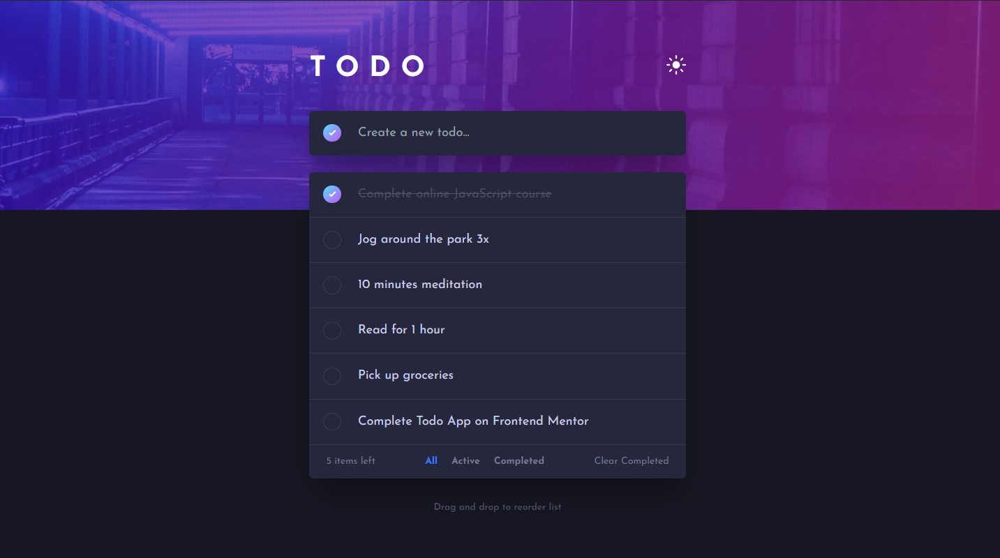
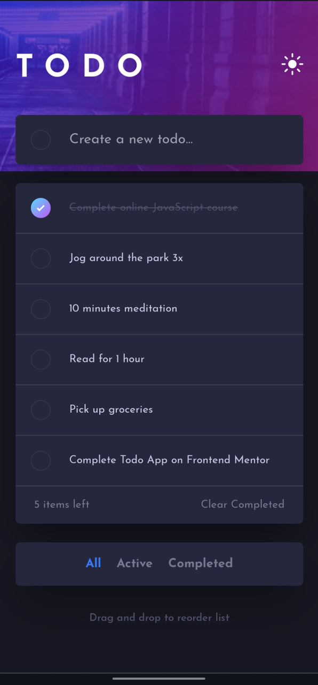

# Frontend Mentor - Todo app

This is a solution to the [Todo app challenge on Frontend Mentor](https://www.frontendmentor.io/challenges/todo-app-Su1_KokOW). Frontend Mentor challenges help you improve your coding skills by building realistic projects. 

## Table of contents

- [Overview](#overview)
  - [The challenge](#the-challenge)
  - [Result](#result)
  - [Built with](#built-with)
- [Author](#author)

## Overview

### The challenge

Your users should be able to:

- View the optimal layout for the app depending on their device's screen size
- See hover states for all interactive elements on the page
- Add new todos to the list
- Mark todos as complete
- Delete todos from the list
- Filter by all/active/complete todos
- Clear all completed todos
- Toggle light and dark mode
- **Bonus**: Drag and drop to reorder items on the list

### Result

### Built with

- Nextjs 13.5.4
- TypeScript
- [Tailwind CSS](https://tailwindcss.com/)
- ESLint (Airbnb style guide)
- API fetching
- MongoDB database
- Prisma

## Author

- Frontend Mentor - [@somebodyin](https://www.frontendmentor.io/profile/somebodyin)